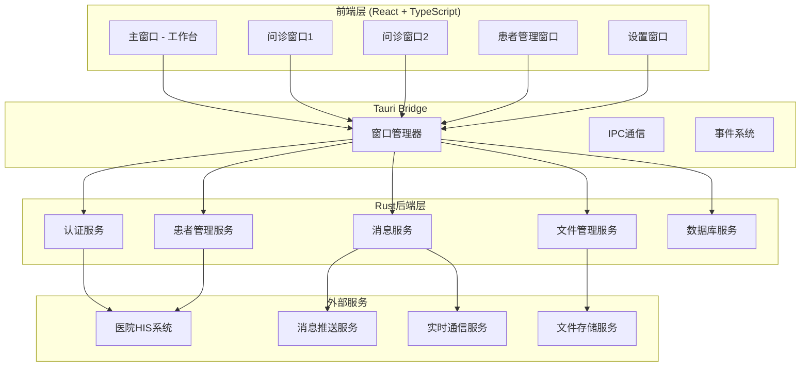
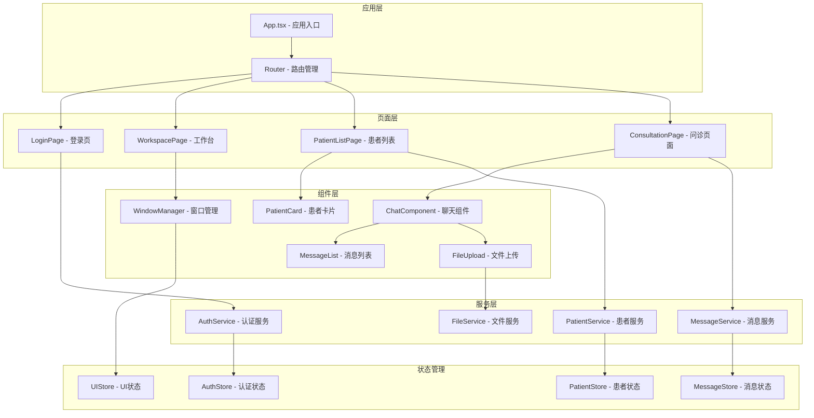

# 设计文档

## 概述

本设计文档描述了基于 Tauri + React + TypeScript 技术栈的互联网医院桌面应用架构。该应用采用现代化的前后端分离架构，充分利用 Tauri 的跨平台能力和 Rust 的性能优势，为医生提供高效、安全、稳定的办公环境。

核心设计理念：

- **多窗口优先**：充分利用桌面端多窗口管理优势
- **安全第一**：符合医疗数据安全和隐私保护要求
- **离线友好**：支持网络不稳定环境下的基本功能
- **模块化架构**：便于 MVP 后的功能迭代扩展

## 架构

### 整体架构



### 技术栈选择

**前端技术栈：**

- React 19 + TypeScript：现代化 UI 开发
- Vite：快速构建和热重载
- React Router：单页面应用路由管理
- Zustand：轻量级状态管理
- React Query：服务端状态管理和缓存
- Ant Design：企业级 UI 组件库
- Socket.io-client：实时通信

**后端技术栈：**

- Tauri 2.0：跨平台桌面应用框架
- Rust：高性能系统编程语言
- SQLite：本地数据存储
- Tokio：异步运行时
- Serde：序列化/反序列化
- Reqwest：HTTP 客户端
- Tungstenite：WebSocket 客户端

## 组件和接口

### 前端组件架构



### 核心接口定义

**认证接口：**

```typescript
interface AuthService {
  login(credentials: LoginCredentials): Promise<AuthResult>
  logout(): Promise<void>
  refreshToken(): Promise<string>
  validateSession(): Promise<boolean>
}

interface LoginCredentials {
  type: "password" | "sms" | "realname"
  username?: string
  password?: string
  phone?: string
  smsCode?: string
  idCard?: string
}
```

**患者管理接口：**

```typescript
interface PatientService {
  getPatientList(query: PatientQuery): Promise<PatientList>
  getPatientDetail(patientId: string): Promise<PatientDetail>
  updatePatientTags(patientId: string, tags: string[]): Promise<void>
  searchPatients(keyword: string): Promise<Patient[]>
}

interface Patient {
  id: string
  name: string
  age: number
  gender: "male" | "female"
  phone: string
  tags: string[]
  lastVisit: Date
  medicalHistory: MedicalRecord[]
}
```

**消息通信接口：**

```typescript
interface MessageService {
  sendMessage(consultationId: string, message: Message): Promise<void>
  getMessageHistory(consultationId: string, page: number): Promise<MessageList>
  subscribeToMessages(consultationId: string, callback: MessageCallback): void
  uploadFile(file: File): Promise<FileInfo>
}

interface Message {
  id: string
  type: "text" | "image" | "voice" | "file"
  content: string
  sender: "doctor" | "patient"
  timestamp: Date
  status: "sending" | "sent" | "delivered" | "failed"
}
```

### Rust 后端服务接口

**Tauri Commands：**

```rust
#[tauri::command]
async fn authenticate_user(credentials: LoginCredentials) -> Result<AuthResult, String>

#[tauri::command]
async fn get_patient_list(query: PatientQuery) -> Result<Vec<Patient>, String>

#[tauri::command]
async fn send_message(consultation_id: String, message: Message) -> Result<(), String>

#[tauri::command]
async fn create_new_window(window_type: WindowType, data: WindowData) -> Result<String, String>

#[tauri::command]
async fn save_file_locally(file_data: Vec<u8>, file_name: String) -> Result<String, String>
```

## 数据模型

### 本地数据库设计

```sql
-- 用户认证表
CREATE TABLE users (
    id TEXT PRIMARY KEY,
    username TEXT UNIQUE NOT NULL,
    encrypted_token TEXT,
    last_login DATETIME,
    session_expires DATETIME
);

-- 患者信息表
CREATE TABLE patients (
    id TEXT PRIMARY KEY,
    name TEXT NOT NULL,
    age INTEGER,
    gender TEXT,
    phone TEXT,
    tags TEXT, -- JSON数组
    last_sync DATETIME,
    created_at DATETIME DEFAULT CURRENT_TIMESTAMP
);

-- 问诊记录表
CREATE TABLE consultations (
    id TEXT PRIMARY KEY,
    patient_id TEXT,
    doctor_id TEXT,
    status TEXT, -- 'active', 'completed', 'cancelled'
    created_at DATETIME DEFAULT CURRENT_TIMESTAMP,
    updated_at DATETIME DEFAULT CURRENT_TIMESTAMP,
    FOREIGN KEY (patient_id) REFERENCES patients (id)
);

-- 消息记录表
CREATE TABLE messages (
    id TEXT PRIMARY KEY,
    consultation_id TEXT,
    sender_type TEXT, -- 'doctor', 'patient'
    message_type TEXT, -- 'text', 'image', 'voice', 'file'
    content TEXT,
    file_path TEXT,
    timestamp DATETIME DEFAULT CURRENT_TIMESTAMP,
    sync_status TEXT DEFAULT 'pending', -- 'pending', 'synced', 'failed'
    FOREIGN KEY (consultation_id) REFERENCES consultations (id)
);

-- 文件缓存表
CREATE TABLE file_cache (
    id TEXT PRIMARY KEY,
    file_url TEXT,
    local_path TEXT,
    file_size INTEGER,
    mime_type TEXT,
    downloaded_at DATETIME DEFAULT CURRENT_TIMESTAMP
);
```

### 状态管理模型

```typescript
// 认证状态
interface AuthState {
  isAuthenticated: boolean
  user: User | null
  token: string | null
  sessionExpires: Date | null
  login: (credentials: LoginCredentials) => Promise<void>
  logout: () => void
  refreshSession: () => Promise<void>
}

// 患者管理状态
interface PatientState {
  patients: Patient[]
  selectedPatient: Patient | null
  searchQuery: string
  filters: PatientFilters
  loading: boolean
  setPatients: (patients: Patient[]) => void
  selectPatient: (patient: Patient) => void
  updatePatient: (patientId: string, updates: Partial<Patient>) => void
}

// 消息状态
interface MessageState {
  conversations: Map<string, Message[]>
  activeConversation: string | null
  unreadCounts: Map<string, number>
  sendMessage: (consultationId: string, message: Message) => Promise<void>
  markAsRead: (consultationId: string) => void
}

// 窗口管理状态
interface WindowState {
  windows: Map<string, WindowInfo>
  activeWindow: string | null
  createWindow: (type: WindowType, data: any) => Promise<string>
  closeWindow: (windowId: string) => void
  focusWindow: (windowId: string) => void
}
```

## 错误处理

### 错误分类和处理策略

**网络错误：**

- 连接超时：自动重试机制，最多 3 次
- 服务器错误：显示友好错误信息，提供重试选项
- 认证失败：自动跳转登录页面

**数据错误：**

- 数据验证失败：显示具体字段错误信息
- 数据同步冲突：提供冲突解决选项
- 本地存储错误：清理缓存并重新同步

**系统错误：**

- 内存不足：限制同时打开的窗口数量
- 文件系统错误：提供备用存储方案
- 权限错误：引导用户授权

### 错误处理实现

```typescript
// 全局错误处理器
class ErrorHandler {
  static handle(error: AppError): void {
    switch (error.type) {
      case 'NETWORK_ERROR':
        this.handleNetworkError(error)
        break
      case 'AUTH_ERROR':
        this.handleAuthError(error)
        break
      case 'DATA_ERROR':
        this.handleDataError(error)
        break
      default:
        this.handleUnknownError(error)
    }
  }

  private static handleNetworkError(error: NetworkError): void {
    if (error.retryable && error.retryCount < 3) {
      setTimeout(() => error.retry(), 1000 * Math.pow(2, error.retryCount))
    } else {
      NotificationService.showError('网络连接异常，请检查网络设置')
    }
  }
}

// Rust错误处理
#[derive(Debug, thiserror::Error)]
enum AppError {
    #[error("网络请求失败: {0}")]
    NetworkError(#[from] reqwest::Error),

    #[error("数据库操作失败: {0}")]
    DatabaseError(#[from] rusqlite::Error),

    #[error("认证失败: {message}")]
    AuthError { message: String },

    #[error("文件操作失败: {0}")]
    FileError(#[from] std::io::Error),
}
```

## 测试策略

### 测试金字塔

**单元测试 (70%)：**

- React 组件测试：使用 React Testing Library
- Rust 函数测试：使用内置 test 框架
- 状态管理测试：Zustand store 测试
- 工具函数测试：纯函数逻辑测试

**集成测试 (20%)：**

- Tauri 命令测试：前后端通信测试
- 数据库操作测试：SQLite CRUD 测试
- 文件系统测试：本地存储测试
- 网络请求测试：Mock API 测试

**端到端测试 (10%)：**

- 用户流程测试：使用 Playwright
- 多窗口交互测试：窗口管理测试
- 离线功能测试：网络断开场景
- 性能测试：内存和 CPU 使用率

### 测试工具配置

```json
// package.json 测试依赖
{
  "devDependencies": {
    "@testing-library/react": "^14.0.0",
    "@testing-library/jest-dom": "^6.0.0",
    "@testing-library/user-event": "^14.0.0",
    "vitest": "^1.0.0",
    "playwright": "^1.40.0",
    "msw": "^2.0.0"
  }
}
```

```rust
// Cargo.toml 测试依赖
[dev-dependencies]
tokio-test = "0.4"
mockall = "0.12"
tempfile = "3.8"
```

### 关键测试场景

**认证流程测试：**

- 正常登录流程
- 登录失败处理
- Token 过期自动刷新
- 多设备登录冲突

**患者管理测试：**

- 患者列表加载和搜索
- 患者详情查看和编辑
- 标签管理功能
- 数据同步机制

**消息通信测试：**

- 实时消息收发
- 文件上传下载
- 离线消息队列
- 消息状态同步

**多窗口测试：**

- 窗口创建和销毁
- 窗口间数据共享
- 窗口状态管理
- 内存泄漏检测

## 安全考虑

### 数据安全

**传输安全：**

- 所有 API 请求使用 HTTPS
- WebSocket 连接使用 WSS
- 敏感数据传输加密

**存储安全：**

- 本地数据库加密存储
- 敏感信息不存储在本地
- 定期清理过期缓存

**访问控制：**

- JWT Token 认证
- 角色权限验证
- 操作日志记录

### 隐私保护

**数据最小化：**

- 只缓存必要的患者信息
- 定期清理历史数据
- 用户可控的数据保留策略

**匿名化处理：**

- 日志中不包含敏感信息
- 错误报告数据脱敏
- 统计数据匿名化

### 安全实现

```typescript
// 前端安全工具
class SecurityManager {
  static encryptSensitiveData(data: string): string {
    // 使用Web Crypto API加密
    return crypto.subtle.encrypt("AES-GCM", key, data)
  }

  static sanitizeInput(input: string): string {
    // XSS防护
    return DOMPurify.sanitize(input)
  }

  static validateFileType(file: File): boolean {
    // 文件类型验证
    const allowedTypes = ["image/jpeg", "image/png", "application/pdf"]
    return allowedTypes.includes(file.type)
  }
}
```

```rust
// Rust安全实现
use aes_gcm::{Aes256Gcm, Key, Nonce};
use argon2::{Argon2, PasswordHash, PasswordHasher, PasswordVerifier};

pub struct SecurityService {
    cipher: Aes256Gcm,
}

impl SecurityService {
    pub fn encrypt_data(&self, data: &[u8]) -> Result<Vec<u8>, AppError> {
        // 数据加密实现
    }

    pub fn hash_password(&self, password: &str) -> Result<String, AppError> {
        // 密码哈希实现
    }

    pub fn verify_token(&self, token: &str) -> Result<Claims, AppError> {
        // JWT验证实现
    }
}
```

这个设计文档涵盖了系统的核心架构、技术选型、数据模型、错误处理、测试策略和安全考虑。设计充分考虑了医疗应用的特殊需求，包括数据安全、多窗口管理、离线支持等关键特性。
